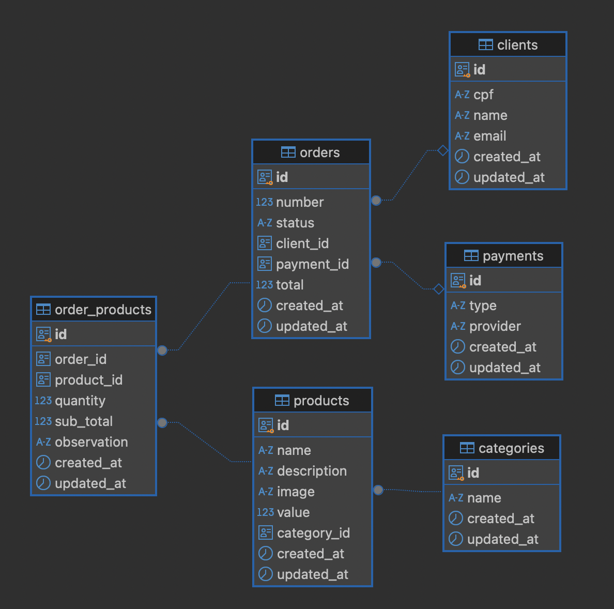
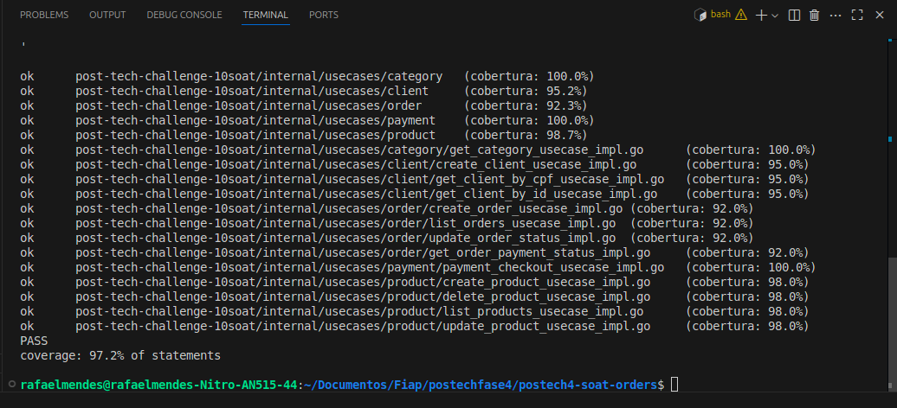

# postechfase4# Desafio Pós-Tech FIAP - API de Gerenciamento de Pedidos

Este projeto implementa uma API RESTful em Go para servir um sistema de pedidos, onde será possível gerenciar clientes, produtos e pedidos, como parte do desafio Pós-Tech em Arquitetura de Software da FIAP. A aplicação utiliza Docker e Docker Compose para facilitar a execução e o desenvolvimento, integrando-se com um banco de dados PostgreSQL.

## Arquitetura

A API inicialmente adotou-se para a Fase 01 arquitetura Hexagonal, e nesse momento para a Fase 02 tem sua base na Clean Architecture, sendo:

Em construção...

## Banco de dados
Para garantir o armazenamento de dados, foi definido o uso de banco de dados relacional por meio do Postgres, no qual temos a seguinte modelagem:


## Tecnologias Utilizadas

* **Go:** Linguagem de programação utilizada para desenvolver a API.
* **Gin:** Framework web para Go, utilizado para roteamento e manipulação de requisições HTTP.
* **PostgreSQL:** Banco de dados relacional para persistência dos dados.
* **Docker:** Plataforma para empacotamento e execução da aplicação em containers.
* **Docker Compose:** Ferramenta para orquestrar múltiplos containers Docker.
* **Swagger:**  Para documentação da API.

## Como Executar

### Pré-requisitos

* Docker
* Docker Compose
* Variavevi de Ambiente (somente local para Apps)

```
export APP_NAME="post-tech-challenge-10soat" && 
export APP_ENV="development" && 
export HTTP_URL="127.0.0.1" && 
export HTTP_PORT="8080" && 
export HTTP_ALLOWED_ORIGINS="*" && 
export DB_CONNECTION="postgres" && 
export DB_HOST="127.0.0.1" && 
export DB_PORT="5432" && 
export DB_NAME="gopos" && 
export DB_USER="postgres" && 
export DB_PASSWORD="postgres" && 
export MONGO_HOST="localhost" && 
export MONGO_PORT="27017" && 
export MONGO_DB="postechdb" && 
export MONGO_USER="mongouser" && 
export MONGO_PASSWORD="mongopass" && 
export MONGO_NAME=postech
```

### Passos

1. **Clone o repositório:**
   ```bash
   git clone https://github.com/seu-usuario/pos-tech-challenge-10soat.git


2. **Navegue até o diretório do projeto:**
   ```bash
   cd pos-tech-challenge-10soat
   

3. **Inicie a aplicação com Docker Compose:**
   ```bash
   docker-compose up -d --build

Este comando irá:

Construir a imagem Docker da aplicação a partir do Dockerfile.
Criar os containers para a aplicação (postech) e o banco de dados (postgres).
Iniciar os containers em modo detached (-d), executando em segundo plano.


4. **Verifique os logs da aplicação:**
   ```bash
   docker-compose logs -f postech

5. **Parando a aplicação:**
   ```bash
   docker-compose down

6. **Acesse a API: A API estará disponível em http://localhost:8080/v1/(endpoints)**

7. **Documentação da API (Swagger): A documentação da API está disponível em http://localhost:8080/docs/index.html**


**Docker**

***Dockerfile***

O Dockerfile define como a imagem Docker da aplicação é construída. Ele utiliza uma imagem base do Go, copia o código-fonte, instala as dependências, compila a aplicação e configura o ponto de entrada. (Veja o arquivo Dockerfile para detalhes).

***Docker Compose***

O docker-compose.yaml define os serviços que compõem a aplicação, incluindo a API (postech) e o banco de dados (postgres). Ele especifica a construção da imagem, as portas que serão mapeadas, as dependências entre os serviços e as variáveis de ambiente. (Veja o arquivo docker-compose.yaml para detalhes).

**Contribuição**

Contribuições são bem-vindas! Sinta-se à vontade para abrir issues e pull requests.

8. **Cobertura de Testes**

As aplicações precisam de 80% de cobertura para serem aprovadas no PR.

